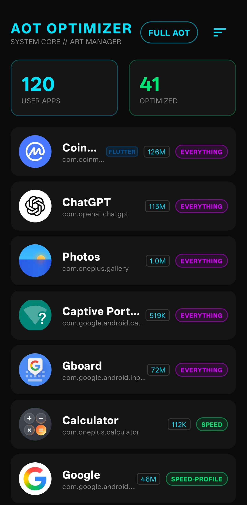
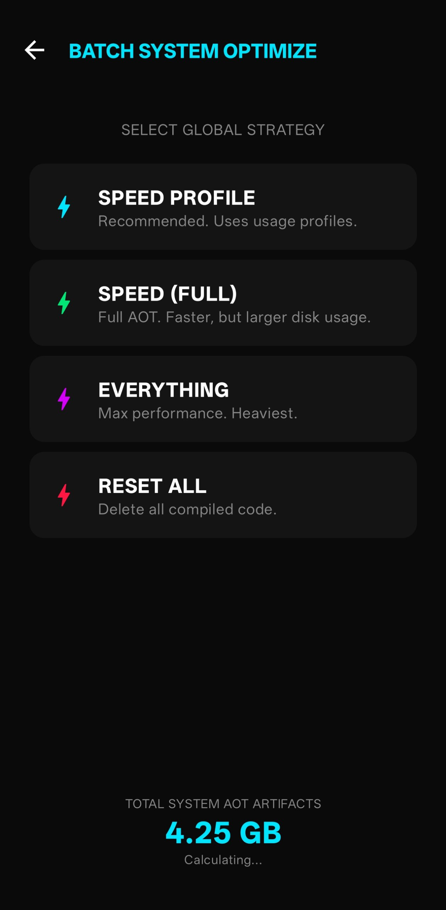
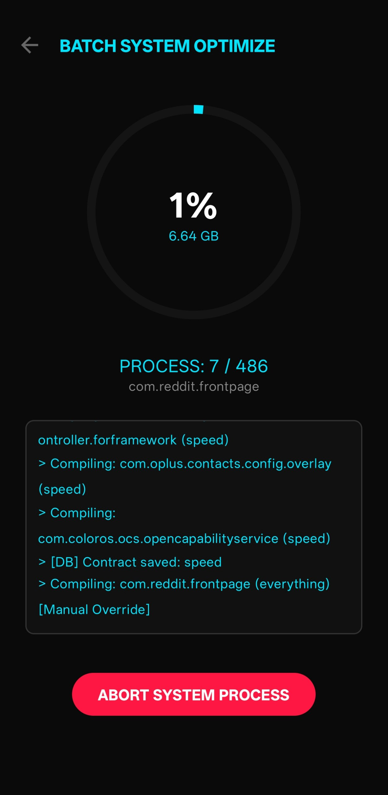

<p align="center">
  
</p>

<h1 align="center">AOT Optimizer</h1>

<p align="center">
  Full control over ART ahead-of-time compilation on a rooted phone.
</p>

<p align="center">
  <a href="https://github.com/xModern54/AOT-Optimizer/actions/workflows/android.yml">
    
  </a>
  
  
  
</p>

Android apps are written in Java and Kotlin. Before they run, the Android Runtime (ART) can compile that bytecode **ahead of time** into native machine code. The app starts faster and spends less time interpreting.

The system already does this, but only in pieces. A little at install, a little during idle maintenance, sometimes from a cloud profile. You wait, you don't pick the mode, and an update can throw the work away.

This app gives you that lever. On a rooted device you compile an app **now**, choose how far (`speed`, `speed-profile`, `everything`, `quicken`), remember the choice, and stop background dexopt from overwriting it.

## What you can do

- Compile any app immediately, not overnight
- Save a **contract** per package so the mode sticks
- Detect **drift** after an update or a system reset, then restore
- Catch new installs and decide: compile or skip
- Turn off Auto-AOT (`bg-dexopt-job` + `pm.dexopt.disable_bg_dexopt`) so the OS does not fight you
- See compile status and oat artifact size

## Screenshots

<p align="center">

| Dashboard | Modes | Batch |
|:---:|:---:|:---:|
|  |  |  |

</p>

## Requirements

- Root (Magisk or KernelSU), for `cmd package compile`
- Android 8.0+ (minSdk 26). Target is API 34.

## Build

| Component | Version |
|:---|:---|
| Gradle | 8.9 |
| Android Gradle Plugin | 8.7.3 |
| Kotlin | 2.0.20 |
| JDK | 17 |
| minSdk / targetSdk | 26 / 34 |

JDK 17, then a `local.properties` that points at your SDK (don't commit it):

```properties
sdk.dir=/path/to/your/android/sdk
```

```bash
./gradlew assembleRelease
```

APK: `app/build/outputs/apk/release/app-release.apk`

Release is signed with the debug keystore so the project builds out of the box. Use your own keystore if you ship it.

## GitHub Actions

CI does not run on every push. Build it from **Actions → Android CI → Run workflow**, or push a tag like `v1.0.0` to publish a GitHub Release.
